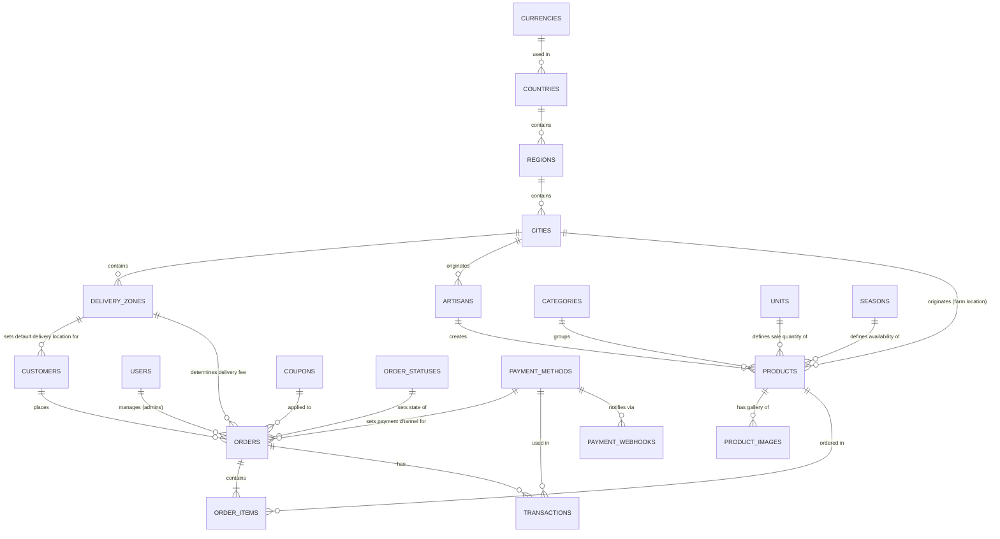

# Bazar-Bio: Database Schema & Entity Relationships (Highly Normalized)

This document outlines the detailed MySQL database schema for the Bazar-Bio e-commerce platform. It incorporates all lookup data, multi-tier localization, customer profiles, artisan tracing, image galleries, coupon support, and mobile money transaction logging.

---

## 📊 Entity Relationship Diagram (Conceptual)

---

## ⚙️ Global Database Configuration (MySQL Best Practices)

* **Engine:** `InnoDB` (supports row-level locking, database transactions, and foreign key constraints).
* **Character Set:** `utf8mb4` (crucial to support French accents and emojis in customer delivery directions or product descriptions).
* **Collation:** `utf8mb4_unicode_ci`.

---

## 🌍 Localization & Multi-Currency Tables

### 1. `currencies`
Supports transactions in multiple currencies (e.g. `FCFA (XAF)`, `Euros (EUR)`, `Dollars (USD)`).

| Column | Type | Constraints | Description |
| :--- | :--- | :--- | :--- |
| `id` | BIGINT | Primary Key, Auto Increment | Unique currency ID |
| `name` | VARCHAR(100) | Not Null, Unique | Currency name (e.g. `'Franc CFA'`) |
| `code` | VARCHAR(10) | Not Null, Unique | ISO code (e.g., `'XAF'`) |
| `symbol` | VARCHAR(10) | Not Null | Symbol (e.g., `'FCFA'`) |
| `exchange_rate` | DECIMAL(12, 6) | Not Null, Default: `1.0` | Exchange rate relative to base currency (XAF) |
| `created_at` | TIMESTAMP | Not Null | Creation timestamp |
| `updated_at` | TIMESTAMP | Not Null | Update timestamp |

**Indexes:**
* Primary Key on `id`
* Unique Index on `code`

---

### 2. `countries`

| Column | Type | Constraints | Description |
| :--- | :--- | :--- | :--- |
| `id` | BIGINT | Primary Key, Auto Increment | Unique country ID |
| `currency_id` | BIGINT | Foreign Key -> `currencies(id)` | Default country currency |
| `name` | VARCHAR(100) | Not Null, Unique | Country name (e.g. `'Cameroun'`) |
| `code` | VARCHAR(5) | Not Null, Unique | Two-letter country code (e.g., `'CM'`) |
| `phone_code` | VARCHAR(10) | Not Null | Phone international dial code (e.g., `'+237'`) |
| `created_at` | TIMESTAMP | Not Null | Creation timestamp |
| `updated_at` | TIMESTAMP | Not Null | Update timestamp |

**Indexes:**
* Primary Key on `id`
* Unique Index on `code`
* Index on `currency_id`

---

### 3. `regions` (States / Provinces)

| Column | Type | Constraints | Description |
| :--- | :--- | :--- | :--- |
| `id` | BIGINT | Primary Key, Auto Increment | Unique region ID |
| `country_id` | BIGINT | Foreign Key -> `countries(id)` | Parent country |
| `name` | VARCHAR(100) | Not Null | Region name (e.g. `'Centre'`) |
| `code` | VARCHAR(50) | | Regional abbreviation (e.g., `'CE'`) |
| `created_at` | TIMESTAMP | Not Null | Creation timestamp |
| `updated_at` | TIMESTAMP | Not Null | Update timestamp |

**Indexes:**
* Primary Key on `id`
* Index on `country_id`
* Unique Index on `(country_id, name)`

---

### 4. `cities`

| Column | Type | Constraints | Description |
| :--- | :--- | :--- | :--- |
| `id` | BIGINT | Primary Key, Auto Increment | Unique city ID |
| `region_id` | BIGINT | Foreign Key -> `regions(id)` | Parent region |
| `name` | VARCHAR(100) | Not Null | City name (e.g. `'Yaoundé'`) |
| `created_at` | TIMESTAMP | Not Null | Creation timestamp |
| `updated_at` | TIMESTAMP | Not Null | Update timestamp |

**Indexes:**
* Primary Key on `id`
* Index on `region_id`
* Unique Index on `(region_id, name)`

---

### 5. `delivery_zones` (Neighborhoods)

| Column | Type | Constraints | Description |
| :--- | :--- | :--- | :--- |
| `id` | BIGINT | Primary Key, Auto Increment | Unique neighborhood ID |
| `city_id` | BIGINT | Foreign Key -> `cities(id)` | Parent city |
| `name` | VARCHAR(100) | Not Null | Neighborhood name (e.g., `'Bastos'`) |
| `delivery_fee` | DECIMAL(12, 2) | Not Null, Default: `1000.00` | Delivery fee in country's base currency |
| `is_active` | BOOLEAN | Default: `true` | Allows suspending deliveries to a neighborhood |
| `created_at` | TIMESTAMP | Not Null | Creation timestamp |
| `updated_at` | TIMESTAMP | Not Null | Update timestamp |

**Indexes:**
* Primary Key on `id`
* Index on `city_id`
* Unique Index on `(city_id, name)`

---

## 🗄️ Master Lookup Tables

### 6. `units` (Product Measurement Units)

| Column | Type | Constraints | Description |
| :--- | :--- | :--- | :--- |
| `id` | BIGINT | Primary Key, Auto Increment | Unique unit ID |
| `name` | VARCHAR(100) | Not Null, Unique | Name of unit (e.g., `'Kilogramme'`) |
| `abbreviation` | VARCHAR(20) | Not Null, Unique | Short code (e.g., `'kg'`) |
| `created_at` | TIMESTAMP | Not Null | Creation timestamp |
| `updated_at` | TIMESTAMP | Not Null | Update timestamp |

**Indexes:**
* Primary Key on `id`
* Unique Index on `name`
* Unique Index on `abbreviation`

---

### 7. `seasons` (Seasonal Availability States)

| Column | Type | Constraints | Description |
| :--- | :--- | :--- | :--- |
| `id` | BIGINT | Primary Key, Auto Increment | Unique season ID |
| `name` | VARCHAR(100) | Not Null, Unique | Human-readable name |
| `code` | VARCHAR(50) | Not Null, Unique | System code (e.g., `'rainy_season'`) |
| `is_active` | BOOLEAN | Default: `true` | Quickly toggle off a whole season's products |
| `created_at` | TIMESTAMP | Not Null | Creation timestamp |
| `updated_at` | TIMESTAMP | Not Null | Update timestamp |

**Indexes:**
* Primary Key on `id`
* Unique Index on `name`
* Unique Index on `code`

---

### 8. `payment_methods` (Supported Payment Options)

| Column | Type | Constraints | Description |
| :--- | :--- | :--- | :--- |
| `id` | BIGINT | Primary Key, Auto Increment | Unique payment method ID |
| `name` | VARCHAR(100) | Not Null, Unique | Public name (e.g., `'MTN Mobile Money'`) |
| `code` | VARCHAR(50) | Not Null, Unique | System identifier (e.g., `'mtn_momo'`) |
| `is_active` | BOOLEAN | Default: `true` | Switch to enable/disable payment method |
| `created_at` | TIMESTAMP | Not Null | Creation timestamp |
| `updated_at` | TIMESTAMP | Not Null | Update timestamp |

**Indexes:**
* Primary Key on `id`
* Unique Index on `name`
* Unique Index on `code`

---

### 9. `order_statuses` (Order Tracking Lifecycle)

| Column | Type | Constraints | Description |
| :--- | :--- | :--- | :--- |
| `id` | BIGINT | Primary Key, Auto Increment | Unique status ID |
| `name` | VARCHAR(100) | Not Null, Unique | Public/Staff display name |
| `code` | VARCHAR(50) | Not Null, Unique | System code (e.g., `'pending'`) |
| `created_at` | TIMESTAMP | Not Null | Creation timestamp |
| `updated_at` | TIMESTAMP | Not Null | Update timestamp |

**Indexes:**
* Primary Key on `id`
* Unique Index on `name`
* Unique Index on `code`

---

### 10. `coupons` (Marketing Campaigns & Promo Codes)
Stores promotional codes used to apply discounts to checkout carts.

| Column | Type | Constraints | Description |
| :--- | :--- | :--- | :--- |
| `id` | BIGINT | Primary Key, Auto Increment | Unique coupon ID |
| `code` | VARCHAR(100) | Not Null, Unique | Code string (e.g., `'WELCOME10'`) |
| `discount_type` | VARCHAR(50) | Not Null | Type: `'percentage'` or `'fixed'` |
| `discount_value` | DECIMAL(12, 2) | Not Null | Discount value (percentage value or XAF amount) |
| `min_order_amount`| DECIMAL(12, 2) | Not Null, Default: `0.00` | Minimum subtotal required to use coupon |
| `max_discount` | DECIMAL(12, 2) | | Maximum cap for percentage discounts |
| `is_active` | BOOLEAN | Default: `true` | Toggle coupon accessibility |
| `starts_at` | DATETIME | | Date coupon becomes valid |
| `expires_at` | DATETIME | | Date coupon expires |
| `created_at` | TIMESTAMP | Not Null | Creation timestamp |
| `updated_at` | TIMESTAMP | Not Null | Update timestamp |

**Indexes:**
* Primary Key on `id`
* Unique Index on `code` (facilitates real-time verification during checkout)
* Index on `is_active`

---

## 🗄️ Identity & Profile Management Tables

### 11. `users` (Admin & Staff Accounts)

| Column | Type | Constraints | Description |
| :--- | :--- | :--- | :--- |
| `id` | BIGINT | Primary Key, Auto Increment | Unique user identifier |
| `email` | VARCHAR(255) | Unique, Not Null | Admin email login |
| `password_digest` | VARCHAR(255) | Not Null | Hashed password (via BCrypt) |
| `first_name` | VARCHAR(100) | | Admin first name |
| `last_name` | VARCHAR(100) | | Admin last name |
| `role` | VARCHAR(50) | Default: `'staff'` | Role: `'admin'`, `'staff'` |
| `created_at` | TIMESTAMP | Not Null | Creation timestamp |
| `updated_at` | TIMESTAMP | Not Null | Update timestamp |

**Indexes:**
* Primary Key on `id`
* Unique Index on `email`

---

### 12. `customers` (Regular Buyers)

| Column | Type | Constraints | Description |
| :--- | :--- | :--- | :--- |
| `id` | BIGINT | Primary Key, Auto Increment | Unique customer ID |
| `email` | VARCHAR(255) | Unique, Not Null | Customer email login identifier |
| `password_digest` | VARCHAR(255) | Not Null | Hashed password (via BCrypt) |
| `first_name` | VARCHAR(100) | Not Null | Customer first name |
| `last_name` | VARCHAR(100) | Not Null | Customer last name |
| `phone` | VARCHAR(50) | Not Null | Delivery / WhatsApp communication number |
| `default_delivery_zone_id` | BIGINT | Foreign Key -> `delivery_zones(id)`, Nullable | Preferred shipping neighborhood |
| `default_delivery_address` | TEXT | Nullable | Specific landmarks or gate descriptors |
| `created_at` | TIMESTAMP | Not Null | Creation timestamp |
| `updated_at` | TIMESTAMP | Not Null | Update timestamp |

**Indexes:**
* Primary Key on `id`
* Unique Index on `email`
* Index on `default_delivery_zone_id`

---

## 🎨 Artisan & Product Gallery Tables (New)

### 13. `artisans` (Craftsman Information)
Tells the story of Cameroonian craftsmen and connects their details with products.

| Column | Type | Constraints | Description |
| :--- | :--- | :--- | :--- |
| `id` | BIGINT | Primary Key, Auto Increment | Unique artisan ID |
| `city_id` | BIGINT | Foreign Key -> `cities(id)` | Location where the artisan operates |
| `name` | VARCHAR(255) | Not Null | Name of the artisan |
| `bio` | TEXT | Not Null | Story, weaving/forging techniques, and philosophy |
| `profile_image_url`| VARCHAR(500) | | Photo of the artisan |
| `created_at` | TIMESTAMP | Not Null | Creation timestamp |
| `updated_at` | TIMESTAMP | Not Null | Update timestamp |

**Indexes:**
* Primary Key on `id`
* Index on `city_id`

---

### 14. `product_images` (Gallery Photos)
Supports multiple product images, which is essential for jewelry detail inspection.

| Column | Type | Constraints | Description |
| :--- | :--- | :--- | :--- |
| `id` | BIGINT | Primary Key, Auto Increment | Unique image ID |
| `product_id` | BIGINT | Foreign Key -> `products(id)`, On Delete Cascade | Associated product |
| `image_url` | VARCHAR(500) | Not Null | Image asset URL |
| `position` | INT | Default: `0` | Order index (e.g. `0` for primary image) |
| `created_at` | TIMESTAMP | Not Null | Creation timestamp |
| `updated_at` | TIMESTAMP | Not Null | Update timestamp |

**Indexes:**
* Primary Key on `id`
* Index on `product_id`
* Index on `(product_id, position)` (optimizes query ordering when rendering sliders)

---

## 🗄️ Core Business Tables

### 15. `categories` (Product Classification)

| Column | Type | Constraints | Description |
| :--- | :--- | :--- | :--- |
| `id` | BIGINT | Primary Key, Auto Increment | Unique category ID |
| `name` | VARCHAR(100) | Not Null, Unique | Category name |
| `slug` | VARCHAR(100) | Not Null, Unique | URL slug (e.g. `legumes-frais`) |
| `description` | TEXT | | Description |
| `created_at` | TIMESTAMP | Not Null | Creation timestamp |
| `updated_at` | TIMESTAMP | Not Null | Update timestamp |

**Indexes:**
* Primary Key on `id`
* Unique Index on `name`
* Unique Index on `slug`

---

### 16. `products` (Inventory Items)

| Column | Type | Constraints | Description |
| :--- | :--- | :--- | :--- |
| `id` | BIGINT | Primary Key, Auto Increment | Unique product ID |
| `category_id` | BIGINT | Foreign Key -> `categories(id)` | Associated category |
| `unit_id` | BIGINT | Foreign Key -> `units(id)` | Product sales unit (e.g., kg) |
| `season_id` | BIGINT | Foreign Key -> `seasons(id)` | Product seasonal status |
| `origin_city_id` | BIGINT | Foreign Key -> `cities(id)` | Origin city of item (farm origin) |
| `artisan_id` | BIGINT | Foreign Key -> `artisans(id)`, Nullable | References creator (for jewelry items) |
| `name` | VARCHAR(255) | Not Null | Product name |
| `description` | TEXT | | Product description |
| `price` | DECIMAL(12, 2) | Not Null, Min: `0.00` | Price in base currency |
| `type` | VARCHAR(50) | Not Null | Product Type: `'produce'` or `'jewelry'` |
| `stock_quantity` | INT | Default: `0` | Quantity in stock |
| `specifications` | JSON | | Flexible key-value metadata (sizes, shelf lives) |
| `image_url` | VARCHAR(500) | | Legacy primary photo URL (fallback) |
| `is_active` | BOOLEAN | Default: `true` | Hard toggle to hide/show on catalog |
| `created_at` | TIMESTAMP | Not Null | Creation timestamp |
| `updated_at` | TIMESTAMP | Not Null | Update timestamp |

**Indexes:**
* Primary Key on `id`
* Index on `category_id`
* Index on `unit_id`
* Index on `season_id`
* Index on `origin_city_id`
* Index on `artisan_id`
* Index on `is_active`

---

### 17. `orders` (Purchase Orders)

| Column | Type | Constraints | Description |
| :--- | :--- | :--- | :--- |
| `id` | BIGINT | Primary Key, Auto Increment | Unique order ID |
| `order_reference` | VARCHAR(100) | Not Null, Unique | Order tracking code (e.g. `BB-2026-0821-A3`) |
| `customer_id` | BIGINT | Foreign Key -> `customers(id)`, Nullable | Registered customer reference |
| `coupon_id` | BIGINT | Foreign Key -> `coupons(id)`, Nullable | Promo code applied |
| `customer_name` | VARCHAR(255) | Not Null | Customer full name |
| `customer_phone` | VARCHAR(50) | Not Null | Phone number |
| `customer_email` | VARCHAR(255) | | Customer email (optional) |
| `delivery_zone_id` | BIGINT | Foreign Key -> `delivery_zones(id)` | Neighborhood for delivery details |
| `delivery_address_details` | TEXT | Not Null | Specific delivery notes (gate color, landmark) |
| `payment_method_id` | BIGINT | Foreign Key -> `payment_methods(id)` | Selected payment method |
| `order_status_id` | BIGINT | Foreign Key -> `order_statuses(id)` | Current order state |
| `payment_status` | VARCHAR(50) | Default: `'pending'` | Payment status: `'pending'`, `'paid'`, `'failed'` |
| `subtotal` | DECIMAL(12, 2) | Not Null | Total items cost before discounts |
| `discount_amount` | DECIMAL(12, 2) | Not Null, Default: `0.00` | Discount applied via coupon code |
| `delivery_fee` | DECIMAL(12, 2) | Not Null | Cached delivery fee at order creation |
| `total_amount` | DECIMAL(12, 2) | Not Null | Total cost: `(subtotal - discount_amount) + delivery_fee` |
| `customer_notes` | TEXT | | Special customer instructions |
| `created_at` | TIMESTAMP | Not Null | Creation timestamp |
| `updated_at` | TIMESTAMP | Not Null | Update timestamp |

**Indexes:**
* Primary Key on `id`
* Unique Index on `order_reference`
* Index on `customer_id`
* Index on `coupon_id`
* Index on `delivery_zone_id`
* Index on `payment_method_id`
* Index on `order_status_id`
* Index on `created_at`

---

### 18. `order_items` (Order Itemized Breakdown)

| Column | Type | Constraints | Description |
| :--- | :--- | :--- | :--- |
| `id` | BIGINT | Primary Key, Auto Increment | Unique order item ID |
| `order_id` | BIGINT | Foreign Key -> `orders(id)`, On Delete Cascade | Associated order |
| `product_id` | BIGINT | Foreign Key -> `products(id)` | Associated product |
| `quantity` | DECIMAL(10, 2) | Not Null | Quantity ordered (supports decimal weights) |
| `unit_price` | DECIMAL(12, 2) | Not Null | Captured price at time of purchase |
| `total_price` | DECIMAL(12, 2) | Not Null | Quantity * unit_price |
| `created_at` | TIMESTAMP | Not Null | Creation timestamp |
| `updated_at` | TIMESTAMP | Not Null | Update timestamp |

**Indexes:**
* Primary Key on `id`
* Index on `order_id`
* Index on `product_id`
* Unique Index on `(order_id, product_id)`

---

## 🛡️ Transaction Auditing & Webhook Log Tables

### 19. `transactions` (Financial Records)

| Column | Type | Constraints | Description |
| :--- | :--- | :--- | :--- |
| `id` | BIGINT | Primary Key, Auto Increment | Unique transaction ID |
| `order_id` | BIGINT | Foreign Key -> `orders(id)` | Associated order |
| `payment_method_id` | BIGINT | Foreign Key -> `payment_methods(id)` | Payment method used |
| `transaction_reference` | VARCHAR(255) | | MoMo transaction ID, Orange Money ID, etc. |
| `amount` | DECIMAL(12, 2) | Not Null | Paid amount |
| `status` | VARCHAR(50) | Default: `'pending'` | Status: `'pending'`, `'successful'`, `'failed'` |
| `raw_provider_response` | JSON | | API log response from MTN/Orange integrations |
| `created_at` | TIMESTAMP | Not Null | Creation timestamp |
| `updated_at` | TIMESTAMP | Not Null | Update timestamp |

**Indexes:**
* Primary Key on `id`
* Index on `order_id`
* Index on `payment_method_id`
* Index on `transaction_reference`

---

### 20. `payment_webhooks` (Raw Callback Log)
Stores every callback sent by payment operators (MTN/Orange MoMo) or aggregators (e.g. Campay, Monetbil). Vital for dispute audits and tracking failed webhooks.

| Column | Type | Constraints | Description |
| :--- | :--- | :--- | :--- |
| `id` | BIGINT | Primary Key, Auto Increment | Unique webhook log ID |
| `payment_method_id` | BIGINT | Foreign Key -> `payment_methods(id)` | Associated mobile channel |
| `external_transaction_id`| VARCHAR(255) | | Gateway's transaction reference for tracking |
| `request_ip` | VARCHAR(100) | | Source IP of the API request |
| `headers` | JSON | | Incoming HTTP Request headers |
| `payload` | JSON | Not Null | Complete JSON payload sent by payment provider |
| `status` | VARCHAR(50) | Default: `'unprocessed'` | Webhook status: `'unprocessed'`, `'processed'`, `'failed'` |
| `error_log` | TEXT | | Trace details if processing failed |
| `created_at` | TIMESTAMP | Not Null | Creation timestamp |
| `updated_at` | TIMESTAMP | Not Null | Update timestamp |

**Indexes:**
* Primary Key on `id`
* Index on `payment_method_id`
* Index on `external_transaction_id`
* Index on `status`
* Index on `created_at`

---

## 🔗 Relational Integrity & Cascade Rules

1. **Delete Restraints on Lookup Structures:**
   * Deleting an artisan is blocked (`ON DELETE RESTRICT`) if they are linked to active products. 
2. **Product Image Cascade:**
   * If a product is deleted, its gallery records in `product_images` are automatically deleted via `ON DELETE CASCADE`.
3. **Coupon Retention Safety:**
   * Deleting a coupon does not delete corresponding past orders. The relation is configured as `ON DELETE SET NULL` on the `orders` table. The discount value itself remains preserved on the `orders.discount_amount` column.
4. **Webhook Logging Independence:**
   * Webhook requests are logged instantly in `payment_webhooks` before database order-processing transactions are run. This guarantees that even if a database transaction crashes due to a bug, the callback proof of payment remains saved for manual staff review.
